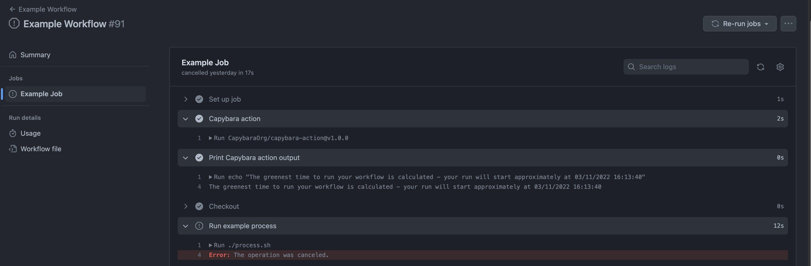
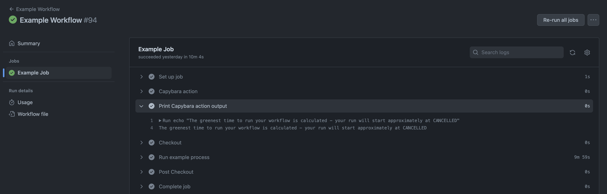

# Capybara GitHub Action Demo

Demo repository which is using [capybara-action](https://github.com/CapybaraOrg/capybara-action).

The repository contains simple [example-workflow.yml](.github/workflows/example-workflow.yml) which is executing dummy
[process.sh](./process.sh) script which simulates a long running process (currently set to 10 minutes).

## Requirements

This demo follows the instructions from [Usage and Setup](https://github.com/CapybaraOrg/capybara-action#usage-and-setup).

## Usage

Please see [example-workflow.yml](.github/workflows/example-workflow.yml).

## Demo

The workflow was initially triggered at `3/11/2022 14:13` and
Capybara GitHub Action cancelled and reported that the best carbon efficient time to run the workflow will be at `03/11/2022 16:13`

Link to the workflow run (available temporary) -
[https://github.com/CapybaraOrg/capybara-demo/actions/runs/3386419010/jobs/5625789584](https://github.com/CapybaraOrg/capybara-demo/actions/runs/3386419010/jobs/5625789584)

After that we can see that Capybara triggered another run of the workflow at `03/11/2022 16:14`

Link to the workflow run (available temporary) -
[https://github.com/CapybaraOrg/capybara-demo/actions/runs/3387334958](https://github.com/CapybaraOrg/capybara-demo/actions/runs/3387334958)
